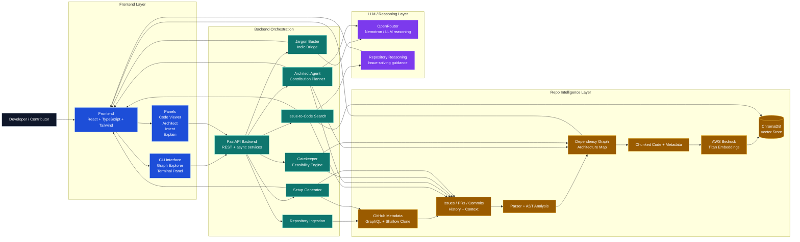

# Drop2Life_OpenSource

Drop2Life_OpenSource is an AI-powered onboarding navigator that acts as a "Digital Senior Mentor" for your codebase.

## Key Features
1. **Repository Ingestion & Visualization:** Deterministic parsing of Python ASTs to generate comprehensive visual dependency graphs.
2. **Issue-to-Code Mapping:** Hybrid Dense + Sparse Vector Search utilizing AWS Titan v2 and ChromaDB.
3. **Architectural Intent:** Analyzes historical Pull Requests via GitHub GraphQL and OpenRouter to explain *why* code exists. 
4. **The Indic Bridge (Jargon Buster):** LLM-powered mentor that simplifies technical jargon in English, Hindi, Tamil, Hinglish, etc.
5. **Environment Setup Guidance:** Scans repo configs to generate 1-click Bash/PowerShell setup scripts.
6. **Beginner Issue Matcher:** Identifies "Good First Issues" and flags if they are actively being worked on in other PRs.
7. **Drop2Life_OpenSource Architect (Agentic Onboarding):** End-to-end contribution planner that graphs blast-radiuses and reads terminal outputs.
8. **Personalized Feasibility Engine:** Repo gatekeeper and stateless User Profile context injection to ensure the AI speaks at the right skill level.

## System Architecture



## How to Run the Project Locally

The project consists of a FastAPI backend and a Streamlit Tester UI. Both run from the `backend/` directory using Python 3.12.

### 1. Prerequisites
- Python 3.12 installed (`py -3.12 --version` on Windows)
- Git installed and on your PATH

### 2. First-Time Setup
Open your terminal and navigate to the backend directory:
```powershell
cd backend
```

Create a virtual environment and install dependencies:
```powershell
py -3.12 -m venv .venv
.venv\Scripts\pip install -r requirements.txt
```

### 3. Environment Variables
Copy `.env.example` to `.env`:
```powershell
cp .env.example .env
```
Open `.env` and add:
- `GITHUB_PAT`: Your GitHub Personal Access Token (prevents rate limits during ingestion)
- `OPENROUTER_API_KEY`: Required for Phase 2 AI features (OpenRouter Nemotron-3)
- `AWS_ACCESS_KEY_ID` & `AWS_SECRET_ACCESS_KEY`: Required for Phase 2 AI embeddings (AWS Titan v2)

---

### 4. Running the Servers

You need **two separate terminal windows**.

**Terminal 1 — Run the FastAPI Backend:**
```powershell
cd backend
.venv\Scripts\uvicorn main:app --host 127.0.0.1 --port 8000 --reload
```
*The API is now running at `http://127.0.0.1:8000`. You can view interactive docs at `http://127.0.0.1:8000/docs`.*

**Terminal 2 — Run the Streamlit Tester UI:**
```powershell
cd backend
.venv\Scripts\streamlit run tester\app.py --server.port 8501
```
*The UI will automatically open in your browser at `http://localhost:8501`. If you get ingestion errors, check the logs in Terminal 1.*